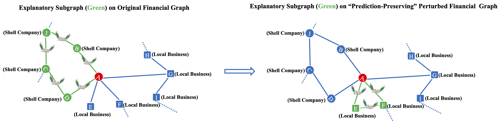

This repository is the official implementation of *White-box Adversarial Attacks on Post-hoc GNN Explanations* (Paper under review). 

# When Predictions Remain but Explanations Shift: White-box Adversarial Attacks on Post-hoc GNN Explanations

<p align="center">

</p>

For post-hoc GNN explainers, the explanatory subgraph on the perturbed graph (right) that receives “prediction-preserving" perturbations can largely differ from that on the original graph (left).


## Requirements

python==3.8.1

To install requirements:

```setup
pip install -r requirements.txt
```

## Reproduce all experiment results

Generate all datasets used in the paper (optional, as the datasets used in the paper have already been uploaded):
```give permission
chmod +x All_datasets.sh
```
```run all experiments
./All_datasets.sh
```

Reproduce the experiment results in Table 1 in our paper:

```give permission
chmod +x All_experiments.sh
```
```run all experiments
./All_experiments.sh
```
Reproduce the experiment results in Table 2 in our paper:

```Investigate the transferability of GXAttack
python GXAttacker_transfer.py --dataset_name "your_dataset_name"
```

## Generating new dataset and run GXAttack on it:
Additionally, if you want to customize a dataset, you can follow the steps below to generate a DIY dataset, and then run GXAttack on this dataset.

Generate a new dataset by yourself
```Generate dataset and save it
python Generate_Dataset.py --dataset_name "your_diy_dataset_name" --shape "str" --num_subgraphs int --subgraph_size int --prob_connection float
```
Run GXAttack on your new dataset:
```Run GXAttack on new dataset
python run.py --dataset_name "your_diy_dataset_name"
```


## Results on All Synthetic Datasets
Table 1. _Average ± standard deviations across 5 trials. O. GEA means explanation accuracy on original graph and P. GEA indicates explanation accuracy on perturbed graph. ΔGEA is the explanation accuracy change after perturbation, Sim_cos is the cosine similarity between explanations (before and after perturbations), and #Pert. represents the number of flipped edges. ΔLabel is the average change of predicted labels, while ΔProb denotes the average absolute change of predicted probability (of the original predicted class). "GXAttack", "Rnd. Flipping", and "Rnd. Rewiring" correspond to our attack method, the random flipping baseline, and the random rewiring baseline, respectively. ↑ indicates larger values are preferred while ↓ means the opposite._

| Explainer     | Metric       | Syn1        | Syn2        | Syn3        | Syn4        | Syn5        | Syn6        | Syn7        |
|---------------|--------------|-------------|-------------|-------------|-------------|-------------|-------------|-------------|
|               | O. GEA       | 0.678±0.046 | 0.641±0.022 | 0.494±0.012 | 0.469±0.006 | 0.439±0.014 | 0.306±0.025 | 0.429±0.013 |
| **GXAttack**  | P. GEA (↓)   | 0.497±0.041 | 0.375±0.011 | 0.308±0.010 | 0.312±0.003 | 0.290±0.004 | 0.217±0.013 | 0.287±0.014 |
|               | ΔGEA (↑)     | 0.181±0.020 | 0.267±0.014 | 0.186±0.013 | 0.157±0.010 | 0.149±0.015 | 0.088±0.014 | 0.142±0.009 |
|               | Sim_cos (↓)  | 0.921±0.007 | 0.975±0.001 | 0.980±0.004 | 0.976±0.003 | 0.978±0.002 | 0.988±0.001 | 0.971±0.040 |
|               | #Pert. (↓)   | 3.300±0.255 | 5.620±0.045 | 6.680±0.148 | 5.900±0.122 | 6.560±0.055 | 5.940±0.167 | 7.020±0.130 |
|               | ΔLabel (↓)   | 0.000±0.000 | 0.002±0.003 | 0.001±0.001 | 0.001±0.001 | 0.001±0.001 | 0.000±0.001 | 0.001±0.001 |
|               | ΔProb (↓)    | 0.106±0.008 | 0.140±0.004 | 0.163±0.003 | 0.150±0.002 | 0.143±0.004 | 0.089±0.003 | 0.147±0.001 |
| **Rnd. Flipping** | P. GEA (↓)| 0.640±0.056 | 0.638±0.023 | 0.493±0.012 | 0.467±0.009 | 0.438±0.013 | 0.306±0.024 | 0.429±0.013 |
|               | ΔGEA (↑)     | 0.038±0.029 | 0.001±0.005 | 0.001±0.002 | 0.002±0.003 | 0.001±0.001 | 0.000±0.005 | 0.000±0.001 |
|               | Sim_cos (↓)  | 0.800±0.006 | 0.945±0.004 | 0.964±0.006 | 0.943±0.005 | 0.966±0.001 | 0.978±0.001 | 0.981±0.001 |
|               | #Pert. (↓)   | 15±0.000    | 15±0.000    | 15±0.000    | 15±0.000    | 15±0.000    | 15±0.000    | 15±0.000    |
|               | ΔLabel (↓)   | 0.051±0.012 | 0.011±0.007 | 0.012±0.004 | 0.009±0.006 | 0.004±0.002 | 0.002±0.002 | 0.004±0.002 |
|               | ΔProb (↓)    | 0.048±0.003 | 0.009±0.005 | 0.006±0.001 | 0.008±0.001 | 0.006±0.001 | 0.003±0.001 | 0.003±0.001 |
| **Rnd. Rewiring** | P. GEA (↓)| 0.149±0.012 | 0.045±0.005 | 0.069±0.004 | 0.067±0.004 | 0.020±0.002 | 0.013±0.001 | 0.020±0.002 |
|               | ΔGEA (↑)     | 0.530±0.043 | 0.596±0.022 | 0.425±0.010 | 0.402±0.003 | 0.419±0.014 | 0.293±0.025 | 0.409±0.012 |
|               | Sim_cos (↓)  | 0.723±0.031 | 0.941±0.006 | 0.975±0.006 | 0.959±0.008 | 0.951±0.004 | 0.970±0.002 | 0.967±0.009 |
|               | #Pert. (↓)   | 16±0.000    | 16±0.000    | 16±0.000    | 16±0.000    | 16±0.000    | 16±0.000    | 16±0.000    |
|               | ΔLabel (↓)   | 0.274±0.030 | 0.199±0.022 | 0.202±0.004 | 0.184±0.011 | 0.214±0.007 | 0.159±0.013 | 0.274±0.014 |
|               | ΔProb (↓)    | 0.234±0.016 | 0.210±0.013 | 0.198±0.007 | 0.200±0.003 | 0.221±0.005 | 0.174±0.013 | 0.259±0.005 |


## Transferability of Attacks on Selected Synthetic Datasets with a Typical Run

Table 2. We report the explanation accuracy (GEA) on the original graph → explanation accuracy on the perturbed graph. The results are consistent on other datasets and thus are deferred to a detailed table to save space.

| Explainer       | Syn1                | Syn2                | Syn3                | Syn4                |
|-----------------|---------------------|---------------------|---------------------|---------------------|
| **PGExplainer** | 0.728 → 0.510       | 0.648 → 0.347       | 0.485 → 0.304       | 0.471 → 0.311       |
| **Grad**        | 0.025 → 0.065       | 0.000 → 0.001       | 0.000 → 0.000       | 0.003 → 0.001       |
| **GradCAM**     | 0.745 → 0.551       | 0.708 → 0.397       | 0.510 → 0.300       | 0.511 → 0.310       |
| **GuidedBP**    | 0.000 → 0.000       | 0.000 → 0.000       | 0.000 → 0.000       | 0.000 → 0.000       |
| **IG**          | 0.118 → 0.104       | 0.134 → 0.103       | 0.136 → 0.101       | 0.109 → 0.092       |
| **GNNExplainer**| 0.738 → 0.550       | 0.711 → 0.397       | 0.539 → 0.341       | 0.514 → 0.327       |
| **SubgraphX**   | 0.113 → 0.015       | 0.532 → 0.375       | 0.296 → 0.141       | 0.417 → 0.282       |
| **PGMExplainer**| 0.015 → 0.064       | 0.046 → 0.039       | 0.031 → 0.034       | 0.036 → 0.041       |
| **RandomExplainer** | 0.184 → 0.146  | 0.170 → 0.096       | 0.135 → 0.102       | 0.124 → 0.090       |


